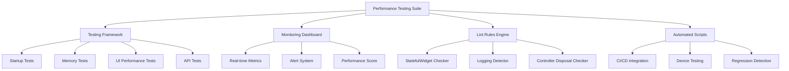

# Performance Testing & Validation Suite Design

## Overview

The Performance Testing & Validation Suite is designed as a comprehensive testing framework specifically tailored for the Champion Car Wash Flutter app. It provides automated performance validation, continuous monitoring, and regression detection capabilities to ensure optimal app performance across all user workflows.

The suite integrates with existing Flutter testing frameworks and DevTools to provide real-time performance insights, automated lint rules, and device-specific testing protocols.

## Architecture

### High-Level Architecture



### Component Architecture

The suite follows a modular architecture with four main components:

1. **Performance Testing Framework**: Core testing logic and validation
2. **Monitoring & Analytics**: Real-time performance tracking and alerting
3. **Static Analysis Engine**: Custom lint rules and code quality checks
4. **Automation Layer**: CI/CD integration and automated testing scripts

## Components and Interfaces

### 1. Performance Testing Framework

#### PerformanceTestSuite Class
```dart
class PerformanceTestSuite {
  static Future<TestResults> runStartupTests();
  static Future<TestResults> runMemoryTests();
  static Future<TestResults> runUIPerformanceTests();
  static Future<TestResults> runAPITests();
  static Future<OverallScore> calculatePerformanceScore();
}
```

**Responsibilities:**
- Execute Champion Car Wash specific performance tests
- Validate startup time with 35+ StatefulWidgets
- Test booking list scrolling performance with 100+ items
- Validate Stripe NFC payment UI responsiveness
- Monitor memory stability during technician workflows

#### TestResults Interface
```dart
class TestResults {
  final String testName;
  final bool passed;
  final double actualValue;
  final double targetValue;
  final String unit;
  final DateTime timestamp;
  final Map<String, dynamic> additionalMetrics;
}
```

### 2. Monitoring & Analytics Component

#### PerformanceMonitor Class
```dart
class PerformanceMonitor {
  static void startMonitoring();
  static void stopMonitoring();
  static PerformanceMetrics getCurrentMetrics();
  static void setAlertThresholds(AlertThresholds thresholds);
  static Stream<AlertEvent> getAlertStream();
}
```

**Key Features:**
- Real-time startup time tracking (target: < 2 seconds)
- Frame rate monitoring (target: 60fps)
- Memory usage tracking (target: < 120MB stable)
- API response time monitoring
- Battery usage measurement

#### AlertSystem Interface
```dart
enum AlertLevel { RED, YELLOW, GREEN }

class AlertEvent {
  final AlertLevel level;
  final String metric;
  final double currentValue;
  final double threshold;
  final String message;
  final DateTime timestamp;
}
```

### 3. Static Analysis Engine

#### Custom Lint Rules Configuration
The engine provides three main lint rule categories:

**StatefulWidget Disposal Checker:**
- Scans all StatefulWidget classes
- Validates presence of dispose() method
- Checks TextEditingController disposal
- Validates StreamSubscription cancellation

**Logging Performance Checker:**
- Detects developer.log() calls in modal files
- Warns about print statements in production code
- Identifies excessive logging that impacts JSON parsing

**Performance Pattern Enforcer:**
- Enforces const constructors where possible
- Validates efficient widget patterns
- Checks for unnecessary rebuilds

### 4. Automation Layer

#### CI/CD Integration Interface
```dart
class CIIntegration {
  static Future<bool> runPerformanceRegression();
  static Future<MemoryLeakReport> detectMemoryLeaks();
  static Future<APIPerformanceReport> validateAPIPerformance();
  static Future<void> generatePerformanceReport();
}
```

#### Device Testing Protocol
```dart
class DeviceTestingProtocol {
  static Future<TestResults> testLowEndDevice();
  static Future<TestResults> testHighEndDevice();
  static Future<BatteryReport> measureBatteryImpact();
  static Future<void> validateCrossDevicePerformance();
}
```

## Data Models

### Performance Metrics Model
```dart
class PerformanceMetrics {
  final double startupTimeMs;
  final int frameSkips;
  final double memoryUsageMB;
  final double apiResponseTimeMs;
  final double frameRate;
  final double batteryDrainPerHour;
  final DateTime timestamp;
  
  double get performanceScore => _calculateScore();
}
```

### Test Configuration Model
```dart
class TestConfiguration {
  final Map<String, double> thresholds;
  final List<String> testSuites;
  final DeviceProfile targetDevice;
  final Duration testDuration;
  final bool enableContinuousMonitoring;
}
```

### Champion Car Wash Specific Models
```dart
class BookingListPerformanceTest {
  final int numberOfBookings;
  final double scrollFPS;
  final double searchResponseTime;
  final bool passedSmoothScrolling;
}

class PaymentPerformanceTest {
  final double stripeInitTime;
  final double nfcResponseTime;
  final bool uiResponsiveness;
  final double paymentProcessingTime;
}

class TechnicianWorkflowTest {
  final double workflowCompletionTime;
  final double memoryStabilityScore;
  final bool noMemoryLeaks;
  final double uiResponseTime;
}
```

## Error Handling

### Performance Test Failures
- **Startup Time Exceeded**: Trigger red alert, log detailed startup breakdown
- **Memory Leak Detected**: Generate detailed leak report with stack traces
- **Frame Rate Drops**: Identify specific UI components causing performance issues
- **API Timeout**: Log network conditions and retry mechanisms

### Monitoring System Failures
- **Dashboard Unavailable**: Fallback to local logging and file-based reports
- **Alert System Down**: Queue alerts for later delivery, maintain local notifications
- **Metric Collection Failure**: Graceful degradation with reduced monitoring scope

### CI/CD Integration Failures
- **Test Environment Issues**: Provide clear error messages and retry mechanisms
- **Performance Regression**: Block deployment with detailed failure reports
- **Device Testing Failures**: Fallback to emulator testing with warnings

## Testing Strategy

### Unit Testing
- Test individual performance measurement functions
- Validate alert threshold calculations
- Test performance score algorithms
- Mock device-specific performance characteristics

### Integration Testing
- End-to-end performance test execution
- Dashboard and alerting system integration
- CI/CD pipeline integration testing
- Cross-device performance validation

### Champion Car Wash Specific Testing
```dart
// Example integration test structure
testWidgets('Champion Car Wash Booking List Performance', (tester) async {
  // Load 100+ booking items
  // Measure scrolling performance
  // Validate 60fps target
  // Test search functionality with debouncing
  // Verify memory stability
});

testWidgets('Technician Workflow Performance', (tester) async {
  // Simulate complete technician workflow
  // Monitor memory usage over 30+ minutes
  // Validate UI responsiveness
  // Test payment processing performance
});
```

### Performance Benchmarking
- Baseline measurements before optimization
- Target performance metrics definition
- Continuous performance regression testing
- Device-specific performance validation

### Automated Test Execution
- Daily performance regression tests in CI/CD
- Pre-deployment performance validation
- Post-deployment performance monitoring
- Weekly comprehensive performance reports

## Implementation Considerations

### Flutter DevTools Integration
- Leverage existing Flutter performance profiling tools
- Integrate with Timeline view for frame analysis
- Use Memory view for leak detection
- Connect with Network view for API performance

### Device Testing Strategy
- **Low-end devices**: MediaTek processors, 2GB RAM, Android 8+
- **Mid-range devices**: Snapdragon 6xx series, 4GB RAM, Android 10+
- **High-end devices**: Snapdragon 8xx series, 8GB+ RAM, Android 12+

### Continuous Monitoring Setup
- Real-time performance metric collection
- Automated alert generation and notification
- Performance trend analysis and reporting
- Integration with existing monitoring infrastructure

### Champion Car Wash Workflow Optimization
- Prioritize technician workflow performance
- Focus on booking management efficiency
- Optimize payment processing user experience
- Ensure supervisor dashboard responsiveness